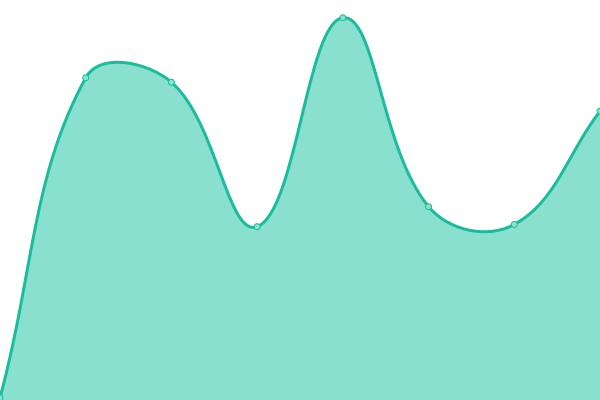
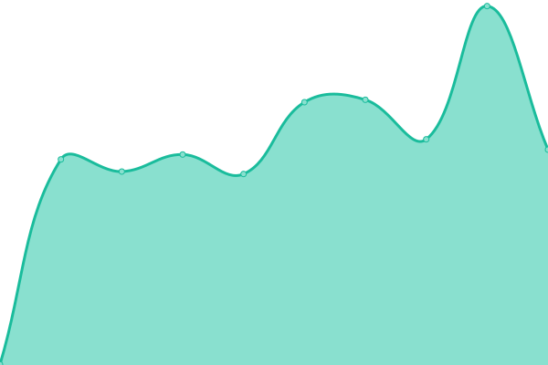

# [📈 Live Status](https://uptime.quivr.app): <!--live status--> **🟩 All systems operational**

This repository contains the open-source uptime monitor and status page for [Stan Girard](https://quivr.app), powered by [Upptime](https://github.com/upptime/upptime).

With [Upptime](https://upptime.js.org), you can get your own unlimited and free uptime monitor and status page, powered entirely by a GitHub repository. We use [Issues](https://github.com/StanGirard/quivr-status/issues) as incident reports, [Actions](https://github.com/StanGirard/quivr-status/actions) as uptime monitors, and [Pages](https://uptime.quivr.app) for the status page.

<!--start: status pages-->
<!-- This summary is generated by Upptime (https://github.com/upptime/upptime) -->
<!-- Do not edit this manually, your changes will be overwritten -->
<!-- prettier-ignore -->
| URL | Status | History | Response Time | Uptime |
| --- | ------ | ------- | ------------- | ------ |
|  [Quivr](https://quivr.app) | 🟩 Up | [quivr.yml](https://github.com/StanGirard/quivr-uptime/commits/HEAD/history/quivr.yml) | 

 872ms
     
 | 

<a href="https://uptime.quivr.app/history/quivr">100.00%</a>
    

|  [Quivr Docs](https://brain.quivr.app) | 🟩 Up | [quivr-docs.yml](https://github.com/StanGirard/quivr-uptime/commits/HEAD/history/quivr-docs.yml) | 

 155ms
     
 | 

<a href="https://uptime.quivr.app/history/quivr-docs">100.00%</a>
    

|  [Quivr API](https://api.quivr.app) | 🟩 Up | [quivr-api.yml](https://github.com/StanGirard/quivr-uptime/commits/HEAD/history/quivr-api.yml) | 

 478ms
     
 | 

<a href="https://uptime.quivr.app/history/quivr-api">100.00%</a>
    

<!--end: status pages-->

[**Visit our status website →**](https://uptime.quivr.app)

## 📄 License

- Powered by: [Upptime](https://github.com/upptime/upptime)
- Code: [MIT](./LICENSE) © [Stan Girard](https://quivr.app)
- Data in the `./history` directory: [Open Database License](https://opendatacommons.org/licenses/odbl/1-0/)
